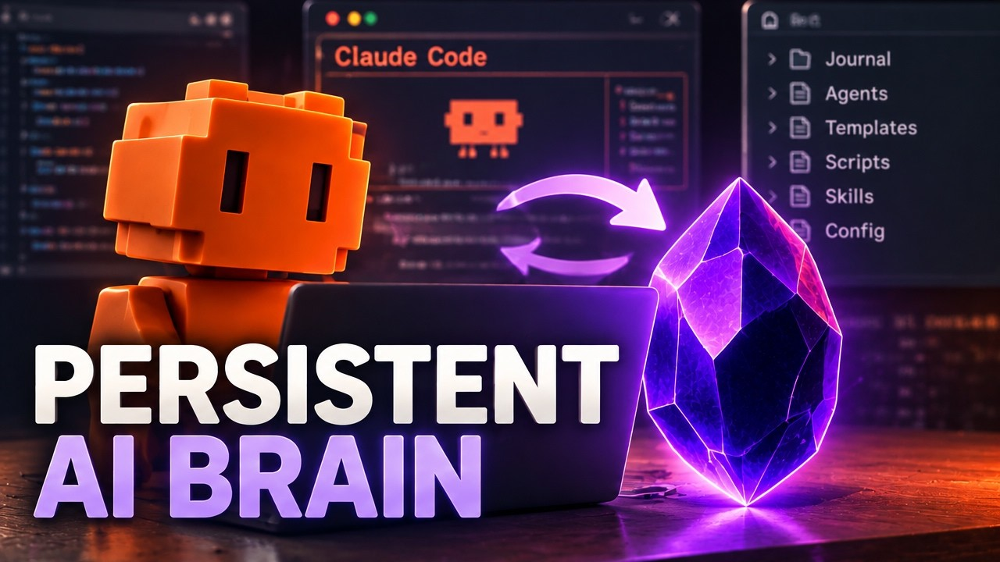
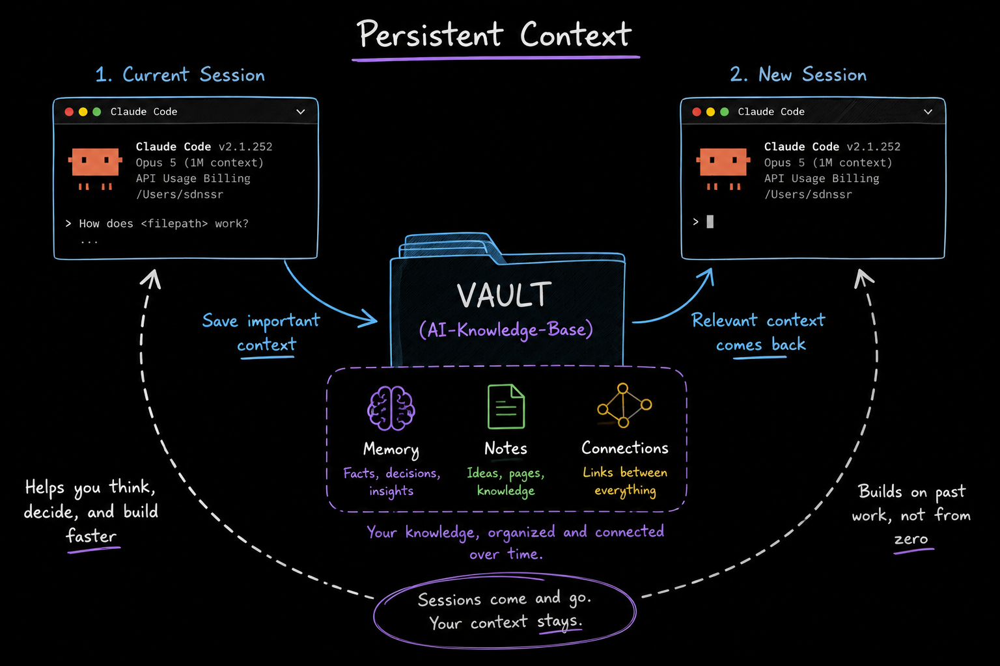
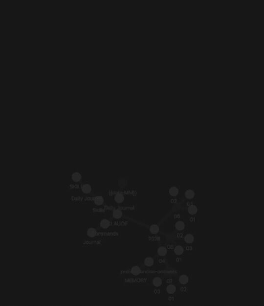
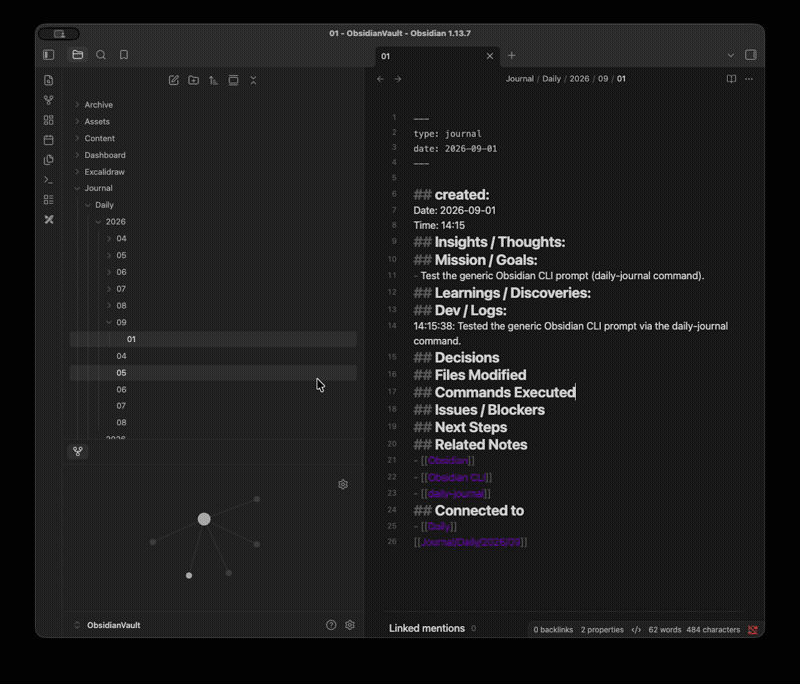

# Claude Obsidian Memory

<p align="center">
  <a href="https://github.com/see-stack/claude-obsidian-memory/generate"></a>
  <a href="https://youtu.be/t_sOfWli9aU"></a>
  <a href="https://seestack.dev"></a>
  <a href="https://github.com/see-stack"></a>
  <a href="LICENSE"></a>
</p>

<p align="center">
  
</p>

A local-first, persistent context, agent workflow, and session-recovery system for **Claude Code** powered by **Obsidian** and the native **Obsidian CLI**.

---

## ⚡ The Problem

Every Claude Code session starts completely blind:
* **Terminal Amnesia**: Every time you launch a new terminal, your AI assistant has zero recollection of previous conversations.
* **Trapped Decisions**: Architectural patterns, completed milestones, and blockers vanish into conversation history or hidden dotfiles.
* **Context Burn**: You waste time and tokens re-explaining project architecture, rules, and setup before getting any real coding done.

---

## 💡 The Architecture & Solution

**Claude Obsidian Memory** turns an Obsidian vault into a real-time, persistent second brain for Claude Code.

<p align="center">
  
</p>

### How It Works:
1. **Plain Markdown Vault**: All memory, custom commands, and skills live inside your Obsidian vault as plain Markdown files.
2. **Symlink Pipeline**: Symbolic links seamlessly connect your vault (`Agents/Commands`, `Agents/Skills`, and `Auto-memory`) directly to `~/.claude/`.
3. **Native Obsidian CLI**: Claude Code invokes the built-in macOS Obsidian CLI binary to inspect, search, and append session logs directly into your knowledge graph.
4. **Autonomous Execution**: Pre-configured permission rules (`Bash(obsidian *)`) allow Claude Code to execute vault commands autonomously without prompting you on every line.
5. **Zero Amnesia Session Recovery**: Days or weeks later, Claude scans your `Year / Month / Day` journal structure, reconstructs unfinished work, and picks up right where you left off.

```text
       ┌────────────────────────────────────────────────────────┐
       │                       CLAUDE CODE                      │
       └───────────────────────────┬────────────────────────────┘
                                   │  
                                   ▼
       ┌────────────────────────────────────────────────────────┐
       │                        TERMINAL                        │
       └───────────────────────────┬────────────────────────────┘
                                   │  Reads & Writes via Symlinks & CLI
                                   ▼
       ┌────────────────────────────────────────────────────────┐
       │                     OBSIDIAN VAULT                     │
       │                                                        │
       │   ├── Agents/                                          │
       │   │   ├── Commands/   (Custom slash commands)          │
       │   │   ├── Skills/     (Reusable agent recipes)         │
       │   │   ├── Scripts/    (Deterministic bash automations) │
       │   │   └── Config/     (Auto-memory & settings.json)    │
       │   ├── Journal/        (Year / Month / Day hierarchy)   │
       │   └── Templates/      (Daily note markdown scaffolds)  │
       └────────────────────────────────────────────────────────┘
```

---

## 🎬 Live Demos: Vault Walkthrough & Graph View

<table>
  <tr>
    <td width="50%" align="center">
      <h3>🌐 Interactive Knowledge Graph</h3>
      <p><i>Real-time connections between Claude agents, skills, commands, and daily sessions.</i></p>
      
    </td>
    <td width="50%" align="center">
      <h3>📝 Vault Structure & Daily Note CLI</h3>
      <p><i>Automated Year/Month/Day note scaffolds updated autonomously via Obsidian CLI.</i></p>
      
    </td>
  </tr>
</table>

Watch the complete, end-to-end setup and the 23-day memory test on YouTube:  
▶️ **[The Permanent Context & Memory Fix for Claude Code](https://youtu.be/t_sOfWli9aU)**

---

## 🛠️ Essential Setup Requirements

To enable fully autonomous, bi-directional memory between Claude Code and Obsidian, three core components must be configured:

1. **Obsidian CLI**: Enables command-line reads, appends, and search inside your vault.
2. **Claude Code Permissions**: Grants autonomous execution permission (`Bash(obsidian *)`) to eliminate approval prompts.
3. **Symlink Wiring**: Connects vault commands, skills, and memory paths to `~/.claude/`.

---

### ⚡ Quick Start: 1-Command Automated Setup

Run the included automated setup script from the root of this repo:

```bash
# Clone the repository
git clone https://github.com/see-stack/claude-obsidian-memory.git
cd claude-obsidian-memory

# Run setup (detects Obsidian, configures symlinks & permissions)
./scripts/setup.sh
```

The script will:
* Symlink the macOS Obsidian binary to `~/.local/bin/obsidian`.
* Symlink `Agents/Commands` to `~/.claude/commands`.
* Symlink `Agents/Skills` to `~/.claude/skills`.
* Inject `"Bash(obsidian *)"` into `~/.claude/settings.json`.
* Set `autoMemoryDirectory` to your vault's `Auto-memory` path.

---

## 📖 Manual Step-by-Step Configuration

If you prefer to configure everything manually, follow the steps below:

### 1. Enable the Obsidian CLI (macOS)

Obsidian includes a built-in command-line binary inside the application bundle at `/Applications/Obsidian.app/Contents/MacOS/obsidian`.

To make it accessible system-wide from any terminal:

```bash
# Link to your user local bin
mkdir -p ~/.local/bin
ln -sf /Applications/Obsidian.app/Contents/MacOS/obsidian ~/.local/bin/obsidian

# Verify the CLI works
obsidian version
obsidian help
```

*(Ensure `~/.local/bin` is in your `PATH`. If not, add `export PATH="$HOME/.local/bin:$PATH"` to your `~/.zshrc` or `~/.bashrc`).*

#### Key Obsidian CLI Commands Used by Claude Code:
* `obsidian append path="<file>" content="<text>"` — Appends timestamped dev logs without altering the rest of your note.
* `obsidian read path="<file>"` — Reads file contents directly from the vault.
* `obsidian search query="<text>"` — Performs rapid full-text vault search.
* `obsidian tasks daily` — Queries pending and completed tasks from daily notes.
* `obsidian open file="<file>"` — Opens the note inside the Obsidian GUI.

---

### 2. Grant Claude Code Autonomous Permissions (`Bash(obsidian *)`)

By default, Claude Code pauses execution and prompts for user confirmation every time a shell command is run. For background memory queries and logging, this breaks the agentic workflow.

Add `"Bash(obsidian *)"` to the `permissions.allow` array in `~/.claude/settings.json`:

```json
{
  "permissions": {
    "allow": [
      "Bash(obsidian *)",
      "Bash(ls *)",
      "Bash(find *)",
      "Bash(mkdir *)"
    ]
  }
}
```

> [!TIP]
> The wildcard pattern `"Bash(obsidian *)"` allows Claude Code to execute `obsidian append`, `obsidian read`, `obsidian search`, and all other vault operations autonomously without interrupting your flow.

---

### 3. Wire Up the Symlinks

Bridge your Obsidian vault to Claude Code's global configuration directory (`~/.claude`):

```bash
# 1. Ensure Claude config directory exists
mkdir -p ~/.claude

# 2. Symlink custom slash commands (/daily-journal, etc.)
ln -sf "/path/to/AI-Knowledge-Base/Agents/Commands" ~/.claude/commands

# 3. Symlink reusable agent skills (recipes with multi-step workflows)
ln -sf "/path/to/AI-Knowledge-Base/Agents/Skills" ~/.claude/skills
```

---

### 4. Redirect Claude Code Auto-Memory to Obsidian

Configure Claude Code to store persistent memories directly inside your vault rather than hidden local state:

In `~/.claude/settings.json`:

```json
{
  "autoMemoryDirectory": "/path/to/AI-Knowledge-Base/Agents/Config/Auto-memory"
}
```

Now, anything Claude commits to memory automatically becomes a note inside your Obsidian vault that you can view, edit, link, and graph.

---

### 5. Configure Obsidian Daily Notes Core Plugin

1. Open Obsidian **Settings** ➔ **Core Plugins** ➔ Enable **Daily Notes** and **Templates**.
2. Under **Templates** settings:
   * Set **Template folder location** to `Templates`.
3. Under **Daily Notes** settings:
   * Set **Date format** to `YYYY/MM/DD`.
   * Set **New file location** to `Journal`.
   * Set **Template file location** to `Templates/Daily`.

---

## ⚡ Using the System in Daily Work

### 1. Launch Claude Code
```bash
claude
```

### 2. Verify Persistent Memory
```text
/memory
```
Claude Code will confirm it is reading and writing to your Obsidian vault's `Auto-memory` directory.

### 3. Log a Session with `/daily-journal`
```text
/daily-journal Implemented authentication hooks and fixed token refresh bug
```
What happens automatically:
1. `daily-journal.sh` executes deterministically, creating today's note (`Journal/YYYY/MM/DD.md`) linked into the parent month and year notes.
2. The `daily-journal` skill triggers `obsidian append` to log timestamped entries under `## Dev / Logs`.
3. Updated tasks and files are recorded and cross-linked into your Obsidian knowledge graph.

### 4. Zero-Amnesia Session Recovery
Close the terminal. Days or weeks later, open a fresh terminal in any project and prompt:
```text
What did we work on in our last session, and what tasks are still pending?
```
Claude will inspect your Obsidian vault, scan the latest journal entries, reconstruct your last state, and report the pending tasks with complete clarity.

---

## 📁 Repository Structure

```text
claude-obsidian-memory/
├── assets/
│   ├── hero-persistent-brain.jpg     # Hero visual banner
│   ├── architecture-diagram.png      # System architecture flow diagram
│   ├── obsidian-vault-demo.gif       # Live Obsidian vault navigation demo
│   └── obsidian-graph-view.gif       # Interactive knowledge graph animation
├── scripts/
│   └── setup.sh                      # 1-command automated configuration script
├── AI-Knowledge-Base/                # Ready-to-use Obsidian Vault template
│   ├── Agents/
│   │   ├── Commands/                 # Custom Claude Code slash commands (.md)
│   │   │   └── Daily-Journal.md      # /daily-journal slash command definition
│   │   ├── Skills/                   # Reusable agent workflows
│   │   │   └── daily-journal/        # Structured skill recipe (SKILL.md)
│   │   ├── Scripts/
│   │   │   └── daily-journal.sh      # Deterministic bash linking & note scaffold
│   │   └── Config/
│   │       ├── Auto-memory/          # Claude Code auto-memory destination
│   │       ├── settings.json         # Symlinked Claude settings
│   │       └── settings.example.json # Template settings reference
│   ├── Journal/                      # Auto-maintained Year / Month / Day hierarchy
│   ├── Templates/
│   │   ├── Daily.md                  # Daily journal scaffold
│   │   ├── Month.md                  # Month overview scaffold
│   │   └── Year.md                   # Year overview scaffold
│   ├── CLAUDE.md                     # Project-level agent instructions
│   └── Agents.md                     # Vault agent root index
└── README.md                         # Project documentation
```

---

## 🔒 Security & Privacy

* **100% Local-First**: No external cloud services or databases required. All memories, notes, and session logs reside on your physical machine in open Markdown.
* **Secret Protection**: Keep API tokens, `.env` files, and credentials out of your vault notes. Never commit keys to Git.

---

## 🌐 Community & Ecosystem

* **Website**: [seestack.dev](https://seestack.dev) — Real AI workflows, tools, and developer setups.
* **YouTube**: [@SeeStack](https://youtube.com/@SeeStack) — Step-by-step video tutorials and system breakdowns.
* **GitHub Organization**: [@see-stack](https://github.com/see-stack)
* **X**: [@seestackx](https://x.com/seestackx) — Rapid tooling drops and architecture notes.
* **Bluesky**: [@seestack.bsky.social](https://bsky.app/profile/seestack.bsky.social)
* **Instagram**: [@see.stack](https://instagram.com/see.stack) — Fast tips and agent demos.

---

## 📄 License

This project is licensed under the [MIT License](LICENSE).
